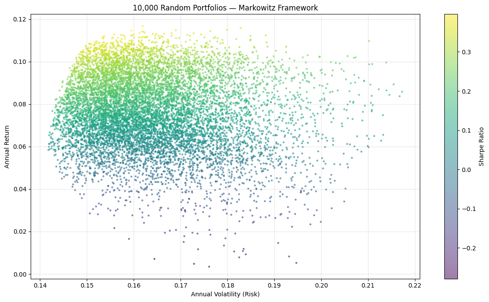

# Markowitz Portfolio Optimisation — NSE Stocks

This repository provides a Python implementation of Modern Portfolio Theory (MPT) to optimize a 5-stock portfolio selected from the Nifty 50. The model calculates the optimal weights required to maximize the Sharpe Ratio based on historical risk-adjusted returns.

---

## What is Markowitz Portfolio Theory?

The core idea is simple: instead of putting all your money in one stock,
find the right *mix* of stocks. Two stocks that move in opposite directions,
when combined, can give better returns with less risk than either one alone.

This is called **diversification** — and Markowitz proved mathematically
in 1952 that there exists an optimal set of portfolios called the
**Efficient Frontier**.

Every portfolio on the Efficient Frontier gives the maximum possible
return for a given level of risk.

---

## Stocks Used

| Stock | Sector | Ticker |
|-------|--------|--------|
| Reliance Industries | Energy + Retail | RELIANCE.NS |
| TCS | Information Technology | TCS.NS |
| HDFC Bank | Banking | HDFCBANK.NS |
| Infosys | Information Technology | INFY.NS |
| Wipro | Information Technology | WIPRO.NS |

I chose stocks from different sectors (energy, banking, IT) to get
meaningful diversification benefits from low cross-sector correlation.

**Data:** 2 years of real NSE closing prices (2024–2026) via `yfinance`

---

## The Mathematics

### Portfolio Return and Risk

For a portfolio with weight vector **w** across n assets:

$$\text{Return} = \mathbf{w}^T \boldsymbol{\mu}$$

$$\text{Volatility} = \sqrt{\mathbf{w}^T \boldsymbol{\Sigma} \mathbf{w}}$$

Where:
- $\boldsymbol{\mu}$ = vector of annualised expected returns
- $\boldsymbol{\Sigma}$ = annualised covariance matrix
- $\mathbf{w}$ = weight vector (must sum to 1)

The second formula is a **quadratic form** — the core of the
optimisation problem.

### Sharpe Ratio

$$\text{Sharpe} = \frac{R_p - R_f}{\sigma_p}$$

Where $R_f$ = RBI repo rate (5.25% as of early 2026).
Higher Sharpe = better risk-adjusted return.

---

## Results

### 10,000 Random Portfolios — Efficient Frontier



Each dot is one randomly generated portfolio. The colour shows
the Sharpe ratio (yellow = high, purple = low). The left edge
of the cloud is the Efficient Frontier.


### Optimal Portfolio Weights

The maximum Sharpe portfolio concentrated in:
- **Reliance Industries** — highest return stock
- **HDFC Bank** — low correlation with Reliance (energy vs banking)

This makes intuitive sense — combining two low-correlation assets
reduces total portfolio volatility without sacrificing return.
This is Markowitz diversification working exactly as the theory predicts.

---

## What I Learned

1. The optimised portfolio significantly outperforms equal-weight
   allocation in Sharpe ratio — better return for roughly the same risk

2. The model naturally concentrated in Reliance + HDFC Bank because
   their low cross-sector correlation reduces the portfolio's
   covariance term `w^T * Sigma * w`

3. No individual stock beats a well-diversified portfolio on the
   risk-return tradeoff — they all sit inside or to the right
   of the portfolio cloud

4. The covariance matrix is the most important mathematical object
   here — getting it right (annualised properly) matters a lot

---

## Limitations

1. **Historical data** — expected returns are estimated from past data,
   which may not reflect future performance
2. **No short selling** — weights are constrained to be positive
3. **No transaction costs** — real portfolios incur rebalancing costs
4. **Static allocation** — weights are not updated over time

---

## How to Run

[](https://colab.research.google.com/drive/1b8_S1H7DtwdXyLm-sOr-Q68l154Ba_Ss#scrollTo=Dt-oEzuRO9UK)

---

## Tech Stack

```
Python    
NumPy      
Pandas     
Matplotlib 
yfinance   
```

---

## References

1. Markowitz, H. (1952). *Portfolio Selection*. Journal of Finance.
2. NSE India — stock data via `yfinance`
3. Reserve Bank of India — repo rate (monetary policy)
